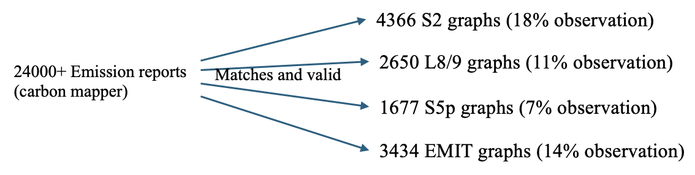
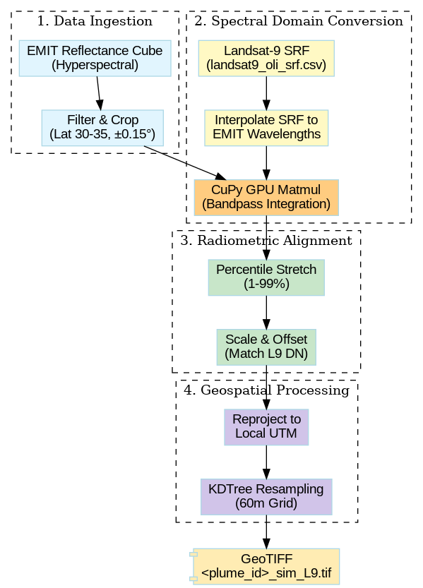
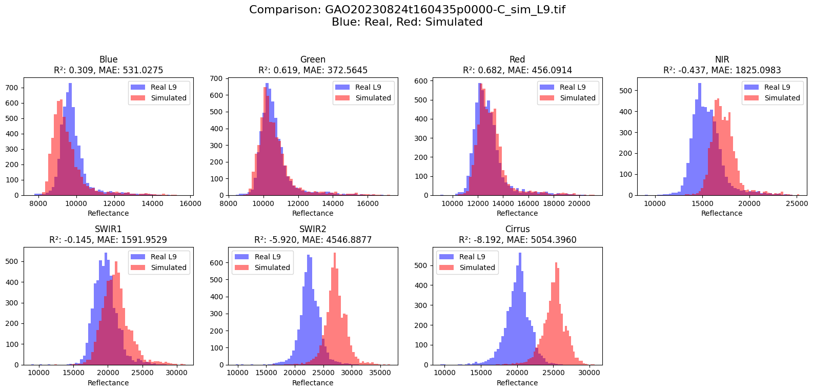
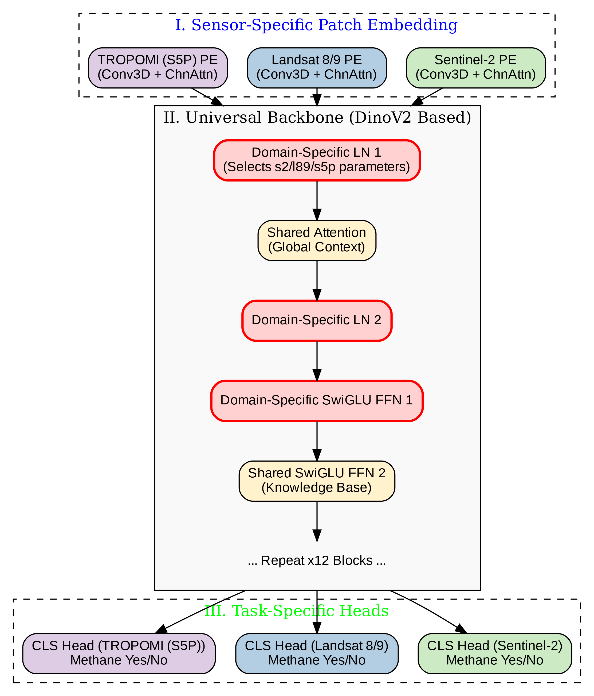
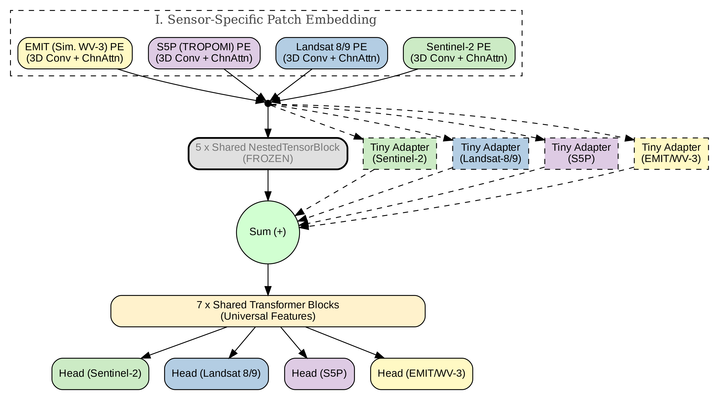
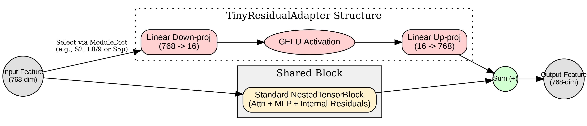

# Methane Emission Detection

> **This repository is a pre-publication portfolio snapshot.**
> To protect unpublished work, the full training code, model checkpoints, and complete datasets will be public in the future. This README documents the core contributions, system design, and provides representative demo artifacts. A full release is planned after paper submission.

This repository showcases research on multi-sensor methane emission detection. It addresses the challenges of observing sparse, transient methane plumes by leveraging a novel multi-sensor dataset and a multi-domain learning method based on ViT models.

## Table of Contents
- [Research Motivation](#research-motivation)
- [Key Contributions](#key-contributions)
- [Methodology](#methodology)
  - [Contribution 1: Multi-Sensor Methane Dataset](#contribution-1-first-multi-sensor-methane-emission-dataset)
  - [Contribution 2: Multi-Domain Learning on ViT](#contribution-2-multi-domain-learning-on-vit)
- [Results](#results)
- [Repository Structure](#repository-structure)
- [Getting Started](#public-safe-demo-artifacts)
- [License](#license)

## Research Motivation

Methane plumes are transient anomalies, making them difficult to detect with traditional remote sensing methods. They are sparse in both space and time, and the long revisit intervals of individual satellites mean that many events are missed. This "revisit-time bottleneck" necessitates a multi-sensor approach to effectively capture these fleeting events.



## Key Contributions

1.  **First Multi-Sensor Methane Emission Dataset:** A comprehensive pipeline that integrates data from multiple satellite sensors (Sentinel-2, Landsat 8/9, Sentinel-5P) and simulated data from EMIT hyperspectral cubes.
2.  **Multi-Domain Learning on Vision Transformer (ViT):** A novel deep learning architecture that treats each satellite as a separate domain, enabling the model to learn both shared and sensor-specific features for improved methane detection.

## Methodology

### Contribution 1: First Multi-Sensor Methane Emission Dataset

I designed a full pipeline that bridges methane-source labels with diverse orbital domains, including:
- **Sentinel-2:** Higher spatial detail, moderate revisit.
- **Landsat 8/9:** Long archive, complementary coverage.
- **Sentinel-5P:** Atmospheric CH4 context, coarser resolution.
- **EMIT:** Hyperspectral data used to simulate additional unavailable sensor views.

#### EMIT -> WorldView-3 / Landsat-style simulation pipeline

A core component of this work is the use of EMIT hyperspectral cubes to synthesize multi-spectral observations for other sensors, such as Worldview-3 and Landsat-9, by integrating their respective spectral response functions (SRFs).

<p align="center">
  
  <br>
  <em>Figure 1: EMIT to Multi-spectral data simulation pipeline.</em>
</p>

<p align="center">
  
  <br>
  <em>Figure 2: Simulated Landsat-9 bands generated from EMIT data.</em>
</p>

### Contribution 2: Multi-Domain Learning on ViT

The proposed model treats each satellite as a separate "domain" and employs a ViT-style backbone to learn a universal representation of methane plumes. Sensor/domain-specific adaptation is achieved through the use of lightweight components like adapters.

- **Input:** Multi-temporal, multi-sensor data cubes.
- **Encoder:** Shared ViT backbone for universal representation.
- **Adaptation:** Sensor/domain-specific components (e.g., LoRA adapters).
- **Output:** Methane presence classifier heads.

<p align="center">
  
  <br>
  <em>Figure 3: Universal + sensor-specific LN/FFN.</em>
</p>

<p align="center">
  
  <br>
  <em>Figure 4: Universal + sensor-specific LoRA adapters.</em>
</p>

<p align="center">
  
  <br>
  <em>Figure 5: Adapter details.</em>
</p>

## Results

The multi-domain learning approach with sensor-specific LoRA adapters demonstrated a significant improvement in overall accuracy compared to single-domain models and a universally shared model.

### Internal Comparison Snapshot

| Models                               | S2    | L8/9  | S5P   | WV3 | Overall Acc |
| ------------------------------------ | ----- | ----- | ----- | --- | ----------- |
| Single-domain models                 | 84.89 | 72.00 | 70.00 |     | 78.82       |
| Universal shared model               | 82.30 | 77.00 | 72.20 |     | 79.73       |
| Universal + sensor-specific LN/FFN   | 83.85 | 78.09 | 71.29 |     | 81.03       |
| Universal + sensor-specific LoRA adapters | **87.33** | **79.04** | **72.30** | | **83.33**     |


## Repository Structure

The repository is organized as follows:

```
├── dataset/              # Scripts and data for dataset creation and preprocessing
├── portfolio/            # Self-contained demo artifacts and figures
│   ├── assets/
│   └── demo/
└── training/             # Placeholders for training scripts and model code
```

## Demo Artifacts

A small, self-contained demo package is available in the [`portfolio/demo`](portfolio/demo) directory:

- [`emit_bandpass_simulation_demo.py`](portfolio/demo/emit_bandpass_simulation_demo.py): Minimal EMIT -> target-sensor synthesis logic.
- [`multidomain_vit_adapter_demo.py`](portfolio/demo/multidomain_vit_adapter_demo.py): Minimal domain-adaptive ViT-style adapter design.
- [`README.md`](portfolio/demo/README.md): Quick usage notes.

## License

A license will be added upon full release of the code and data.
